# Лабораторная работа №3

## Тема

Настройка сети между виртуальными машинами в VirtualBox.

## Цель работы

Цель лабораторной работы — создать три виртуальные машины с Ubuntu и настроить сетевое взаимодействие между ними так, чтобы:

- машина **A** имела доступ в интернет;
- машина **A** имела сетевой доступ к машине **B**;
- машина **A** имела сетевой доступ к машине **C**;
- машина **B** не имела сетевого доступа к машине **C**.

Такая схема показывает, что машина **A** подключена сразу к двум разным внутренним сетям, а машины **B** и **C** изолированы друг от друга.

## Используемое окружение

В работе использовались:
- VirtualBox для macOS / Apple Silicon;
- Ubuntu Server ARM64;
- три виртуальные машины: `Ubuntu-A`, `Ubuntu-B`, `Ubuntu-C`;

Так как работа выполнялась на Mac с ARM-архитектурой, для установки Ubuntu использовался ARM64-образ операционной системы.

## Общая схема сети

Для выполнения задания были использованы три виртуальные машины и две внутренние сети VirtualBox.

| Машина | Адаптер 1 | Адаптер 2 | Адаптер 3 |
|---|---|---|---|
| `Ubuntu-A` | NAT | Internal Network `lab_ab` | Internal Network `lab_ac` |
| `Ubuntu-B` | Internal Network `lab_ab` | — | — |
| `Ubuntu-C` | Internal Network `lab_ac` | — | — |

Использовалась следующая адресация:

| Машина | Интерфейс | Назначение | IP-адрес |
|---|---|---|---|
| `Ubuntu-A` | `enp0s8` | интернет через NAT | `10.0.2.15/24` |
| `Ubuntu-A` | `enp0s9` | связь с `Ubuntu-B` | `192.168.10.1/24` |
| `Ubuntu-A` | `enp0s10` | связь с `Ubuntu-C` | `192.168.20.1/24` |
| `Ubuntu-B` | `enp0s8` | сеть `lab_ab` | `192.168.10.2/24` |
| `Ubuntu-C` | `enp0s8` | сеть `lab_ac` | `192.168.20.2/24` |

Логика схемы такая: `Ubuntu-A` подключена одновременно к двум внутренним сетям, поэтому она видит и `Ubuntu-B`, и `Ubuntu-C`. При этом `Ubuntu-B` и `Ubuntu-C` находятся в разных внутренних сетях VirtualBox, поэтому напрямую они друг друга не видят.

---

## 1. Создание виртуальной машины Ubuntu-A

Сначала была создана первая виртуальная машина `Ubuntu-A`. В мастере создания виртуальной машины были указаны имя машины и тип операционной системы:

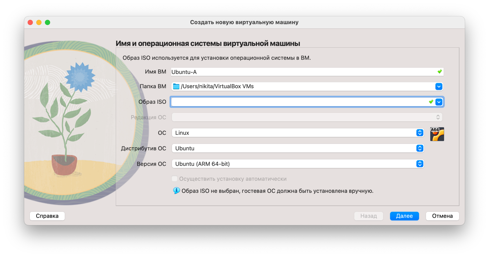

На следующем этапе были указаны параметры автоматической установки Ubuntu. Был создан пользователь `student`, а имя хоста было задано как `Ubuntu-A`.

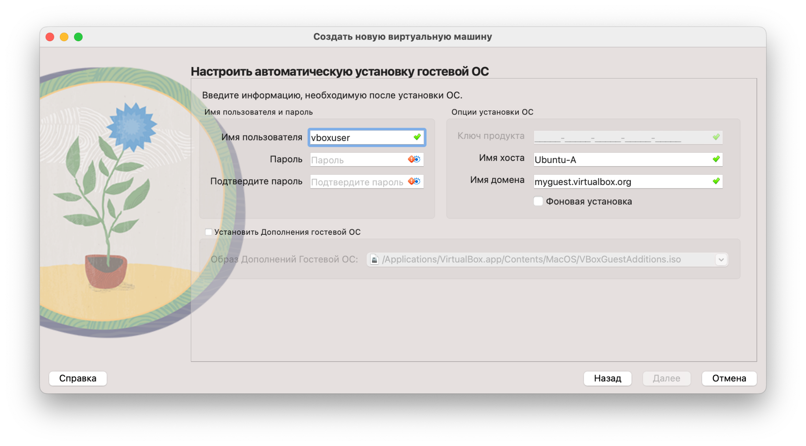

Затем для виртуальной машины были выделены ресурсы:

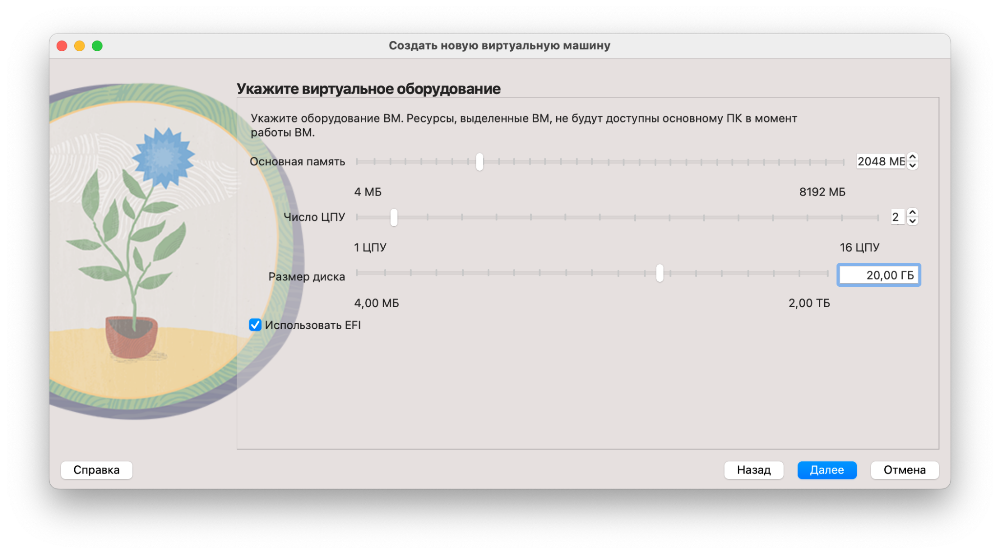

---

## 2. Проверка доступа Ubuntu-A в интернет

Для доступа в интернет у машины `Ubuntu-A` был оставлен первый сетевой адаптер в режиме `NAT`. Такой режим позволяет виртуальной машине использовать сетевое подключение основного компьютера.

После входа в систему была выполнена проверка доступа в интернет командой:

```bash
ping -c 4 google.com
```

Результат показал, что отправлено 4 пакета и получено 4 ответа. Потерь пакетов нет:

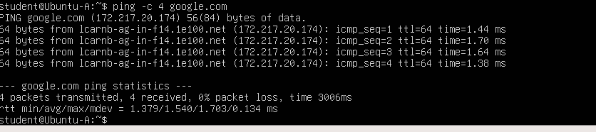

Это означает, что машина `Ubuntu-A` имеет доступ в интернет.


---

## 3. Создание виртуальной машины Ubuntu-B

Чтобы не устанавливать Ubuntu заново, машина `Ubuntu-B` была создана через клонирование `Ubuntu-A`.

При клонировании были выбраны параметры:

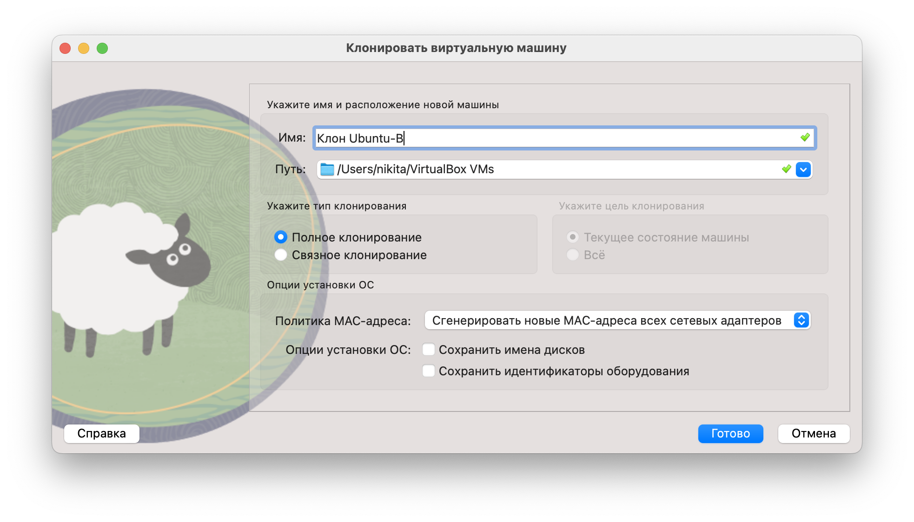

Новые MAC-адреса нужны для того, чтобы VirtualBox и Ubuntu воспринимали клон как отдельную машину в сети.


После создания `Ubuntu-B` её сетевой адаптер был переведён в режим внутренней сети. Для связи между `Ubuntu-A` и `Ubuntu-B` использовалась внутренняя сеть `lab_ab`.

Настройка адаптера для `Ubuntu-B`:

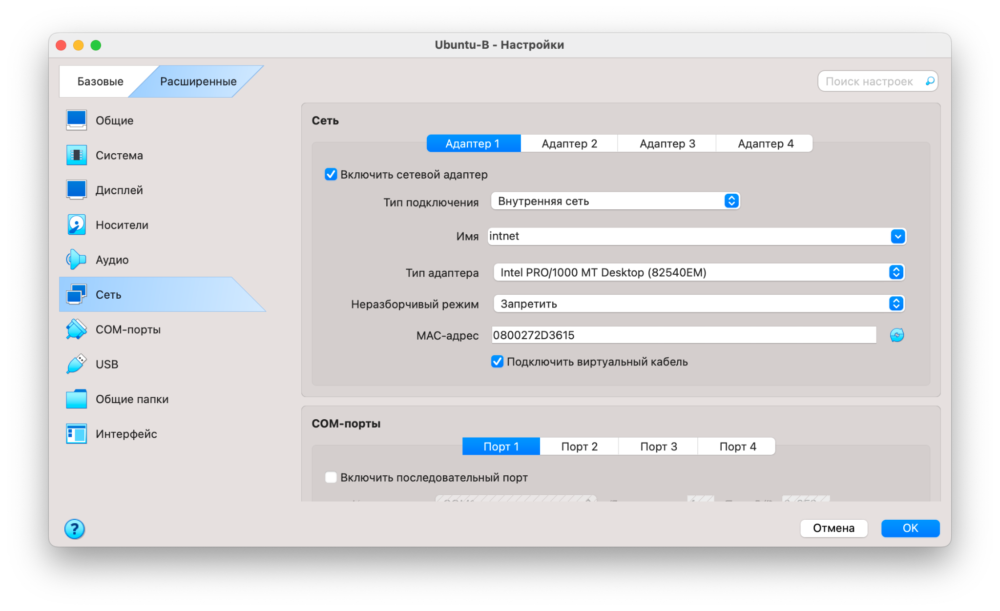

---

## 4. Добавление внутренней сети lab_ab на Ubuntu-A

Для того чтобы `Ubuntu-A` могла взаимодействовать с `Ubuntu-B`, на `Ubuntu-A` был включён второй сетевой адаптер.

Настройки второго адаптера `Ubuntu-A`:

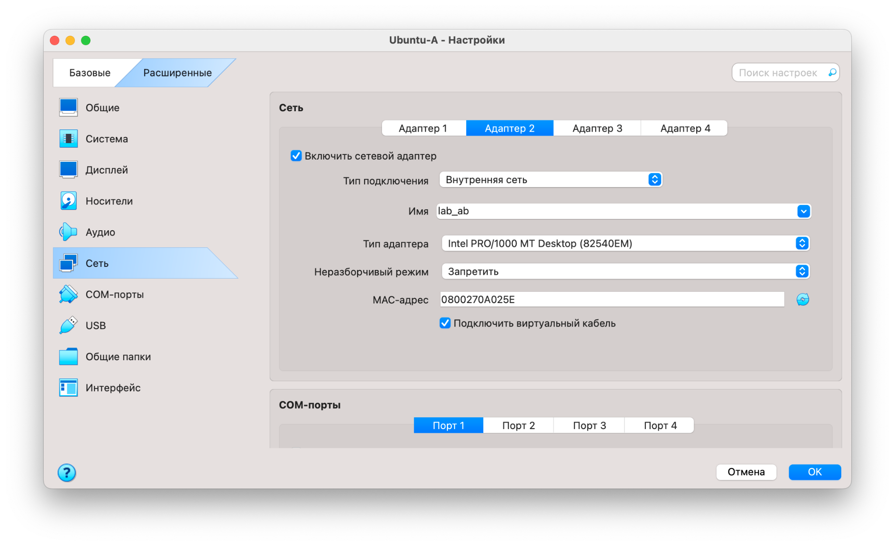

Таким образом, `Ubuntu-A` и `Ubuntu-B` оказались подключены к одной внутренней сети VirtualBox.


После запуска `Ubuntu-A` была выполнена команда просмотра сетевых интерфейсов:

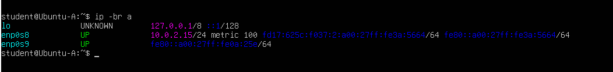

---

## 5. Настройка IP-адресов для связи Ubuntu-A и Ubuntu-B

На машине `Ubuntu-A` интерфейсу `enp0s9` был назначен адрес `192.168.10.1/24`:

```bash
sudo ip addr add 192.168.10.1/24 dev enp0s9
sudo ip link set enp0s9 up
```

На машине `Ubuntu-B` интерфейсу `enp0s8` был назначен адрес `192.168.10.2/24`:

```bash
sudo ip addr add 192.168.10.2/24 dev enp0s8
sudo ip link set enp0s8 up
```

После этого обе машины оказались в одной подсети `192.168.10.0/24`.

Для проверки связи с `Ubuntu-A` была выполнена команда:

```bash
ping -c 4 192.168.10.2
```

Проверка прошла успешно: `Ubuntu-A` получила ответы от `Ubuntu-B`, потерь пакетов не было.

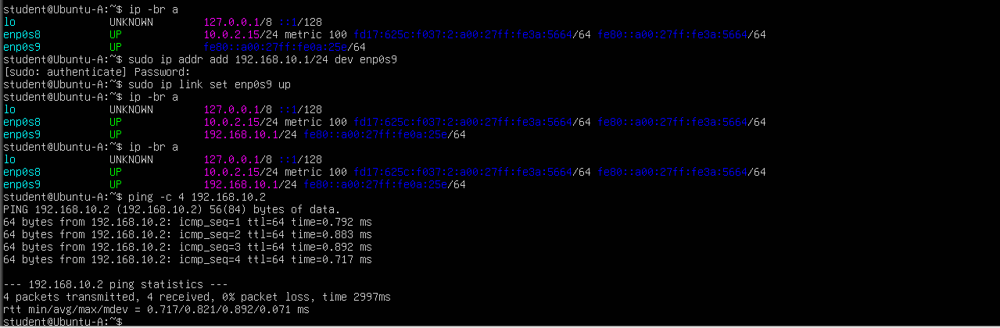

---

## 6. Создание и настройка виртуальной машины Ubuntu-C

Машина `Ubuntu-C` была создана по аналогии с `Ubuntu-B`, через клонирование уже установленной Ubuntu. После клонирования для удобства было изменено имя хоста на `Ubuntu-C`.

Машина `Ubuntu-C` была подключена не к сети `lab_ab`, а к отдельной внутренней сети `lab_ac`. Это сделано специально, чтобы `Ubuntu-B` и `Ubuntu-C` не находились в одной сети и не могли взаимодействовать напрямую.

Настройка для `Ubuntu-C`:

- тип подключения: `Внутренняя сеть`;
- имя сети: `lab_ac`.

На `Ubuntu-A` был добавлен третий адаптер:

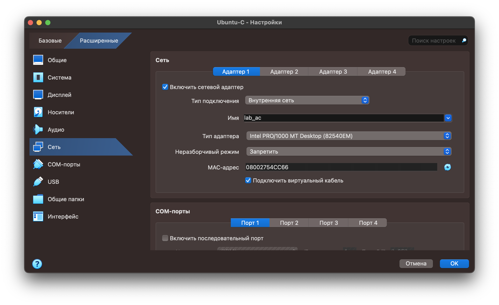

После этого `Ubuntu-A` стала подключена к двум внутренним сетям одновременно: `lab_ab` для связи с `Ubuntu-B`, а `lab_ac` для связи с `Ubuntu-C`.

---

## 7. Настройка IP-адресов для связи Ubuntu-A и Ubuntu-C

На машине `Ubuntu-A` интерфейсу `enp0s10` был назначен адрес `192.168.20.1/24`:

```bash
sudo ip addr add 192.168.20.1/24 dev enp0s10
sudo ip link set enp0s10 up
```

На машине `Ubuntu-C` интерфейсу `enp0s8` был назначен адрес `192.168.20.2/24`:

```bash
sudo ip addr add 192.168.20.2/24 dev enp0s8
sudo ip link set enp0s8 up
```

Затем с `Ubuntu-C` была проверена доступность `Ubuntu-A` по адресу `192.168.20.1`:

```bash
ping -c 4 192.168.20.1
```

Проверка прошла успешно, что подтверждает наличие связи между `Ubuntu-C` и `Ubuntu-A` в сети `lab_ac`.

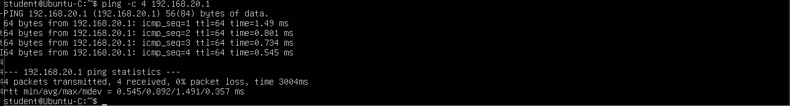


Затем на машине `Ubuntu-A` была выполнена проверка доступности `Ubuntu-C`:

```bash
ping -c 4 192.168.20.2
```

Проверка прошла успешно, что подтверждает наличие связи между `Ubuntu-A` и `Ubuntu-C` в сети `lab_ac`.
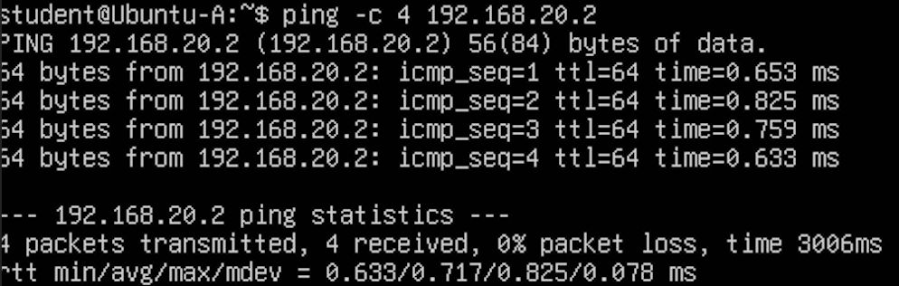


---

## 8. Проверка отсутствия связи Ubuntu-B и Ubuntu-C

По условию лабораторной работы машина `Ubuntu-B` не должна иметь доступ к машине `Ubuntu-C`.

Для проверки на `Ubuntu-B` была выполнена команда:

```bash
ping -c 4 -W 1 192.168.20.2
```

В результате была получена ошибка:

```text
connect: Network is unreachable
```
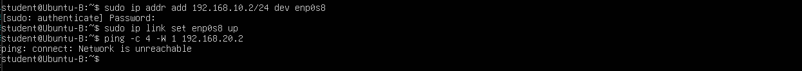

Это означает, что у `Ubuntu-B` нет маршрута до сети `192.168.20.0/24`, где находится `Ubuntu-C`.

Такой результат является правильным, потому что `Ubuntu-B` подключена только к сети `lab_ab`, а `Ubuntu-C` подключена только к сети `lab_ac`. Между этими сетями нет маршрутизации через `Ubuntu-B`.

---

## 9. Итоговая проверка

После настройки были получены следующие результаты:

| Проверка | Команда | Результат |
|---|---|---|
| `Ubuntu-A` → интернет | `ping -c 4 google.com` | работает |
| `Ubuntu-A` → `Ubuntu-B` | `ping -c 4 192.168.10.2` | работает |
| `Ubuntu-A` → `Ubuntu-C` | `ping -c 4 192.168.20.2` | работает |
| `Ubuntu-B` → `Ubuntu-C` | `ping -c 4 -W 1 192.168.20.2` | не работает, `Network is unreachable` |

Итоговая схема получилась такой:

```text
                 Интернет
                    |
                  NAT
                    |
                Ubuntu-A
              /          \
        lab_ab            lab_ac
          |                 |
      Ubuntu-B          Ubuntu-C
```

Машина `Ubuntu-A` подключена к двум внутренним сетям и поэтому может обмениваться пакетами с `Ubuntu-B` и `Ubuntu-C`. Машины `Ubuntu-B` и `Ubuntu-C` находятся в разных внутренних сетях, поэтому напрямую между собой не взаимодействуют.

## Вывод

В ходе лабораторной работы была создана сеть из трёх виртуальных машин Ubuntu в VirtualBox. Машина `Ubuntu-A` получила доступ в интернет через NAT и была подключена к двум внутренним сетям `lab_ab` и `lab_ac`.

Машина `Ubuntu-B` была подключена только к сети `lab_ab`, а машина `Ubuntu-C` — только к сети `lab_ac`. Благодаря такой схеме `Ubuntu-A` смогла взаимодействовать с обеими машинами, но `Ubuntu-B` не получила доступа к `Ubuntu-C`.

Таким образом, все условия лабораторной работы были выполнены.
